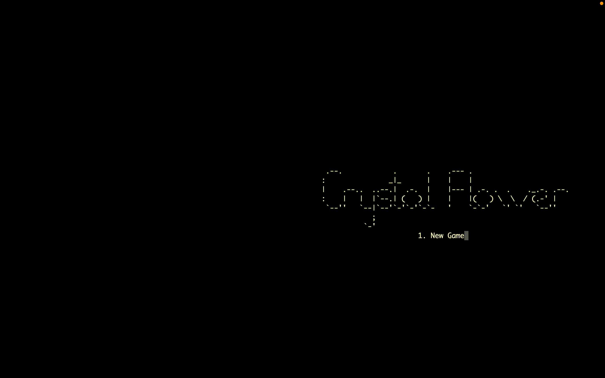
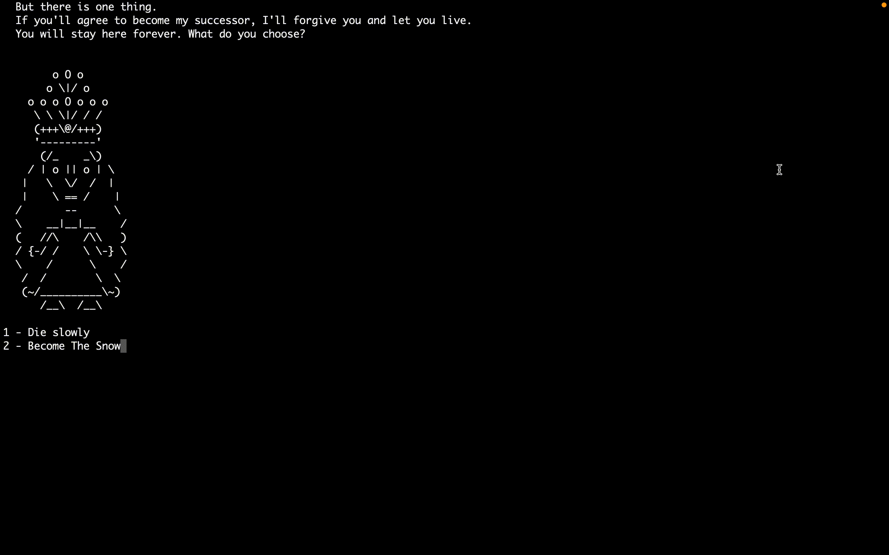

# Crystal Flower
*A text-based game created in C/C++ created by Shaheer Ziya*



## Quick Start Guide:

Open a terminal and move to the directory with the game's code. Then run the commands:

```
make GAME 

./GAME
```

And enjoy playing the game!


## Description:

The story of a young girl who was ready to go through the most possibly dangerous challenges to revive her beloved father back to life. On her way, she met dangerous monsters and showed her courage and ingenuity, using them as a tool to defeat them. 

Immerse yourself in the game and unravel the mystery of the crystal flower. Does it exist? Are the stories about it true? Also, are the gifts of the flower worth risking your life? You will learn all this soon in the game... 

Here, you are the master of your destiny. 

_= So which path will you choose? =_



## Rules:

* Picking a choice is crucial in this game; they let you discover the further development of different story branches or lead to a bad ending(s). Use your best judgement. 

* As a part of the game, a player will be asked to escape the maze mini-game and find clues, which will lead to an important revelation.

* Controls in this game are intuitive and do not require the usage of the computer mouse. Simply type!

* Inputs of the user are not case sensitive. Either use uppercase or lowercase characters (e. g. 'W', 'w', etc).


## Project Requirement:

### 1. Generation of random game sets or events

The game has 6 major chapters, with four stages in the middle that can appear in any order. The plot of the game is written such that no matter which path you chose, the story will make sense. So the 4 chapters in between the Intorduction & Finale can appear in any order during a playthrough.

### 2. Data structures for storing game status

We use structs, STL vectors & arrays among other miscellaneous data structures to store the game status. The two key datapoints for the gamestatus are the current stage & the inventory which are represented as a string and an array of strings.

### 3. Dynamic memory management

The game uses dynamic memory where appropriate. Its major role is in handling the inventory, especially handling the contents of the inventory when saving & loading from a save file.

The inventory is represented in the program as a pointer to an array of strings, generated when neccessary. This choice to make it a pointer is done out of convenince and for the sake of consistency as this is how it is also handled with in the save/load part of the game

### 4. File input/output (e.g., for loading/saving game status)

The game saves & loads data from a save.save file. The functions in the "Save_Load.cpp" file handle with encapsulating the game status in a struct and then writing and reading it from the save file. The save file primarily holds the next stage and the inventory for the user where they left it off in the game.

Note that due to the structure of the plot the player is only offered to save their game at certain checkpoints, otherwise the management of key events would become increasingly complex & tedious. Thankfully, since the stages themselves aren't too long, we thought it was an appropriate design decision.

### 5. Program codes in multiple files

The game has been sectioned into multiple *.cpp & *.hpp files for organization purposes. One glance at the main.cpp file can attest to this fact. Some *.cpp files in fact don't even show up in the main file such as the minigames.cpp file which is a dependency for the story.cpp file instead.

## Features:

### **Interactive Gameplay:**
  
  Decide your fate as you make hard choices while adventuring through Snowland

### **Unique Minigames:**
  
  Play through three different minigames as battle against the various threats of Snowland!

### **Engaging Plot**

### **Rolling text:**
  
  Enjoy the story as the lines are printed character by character allowing you to read it as you go along!

### **Unique Death Messages:**
  
  See unique death messages at the game over screen, possibly also hinting towards which option should've been chosen instead

### **Cheat Proof:**
  
  Don't Cheat! We'll know!
  
  A smart save/load feature that detects hampering with the save file & wipes the state clean to discourage cheating!
  
  To top it off, the save file is put aside in a hidden directory with a .save extension to make it harder for the avergae user to acces it!
  
  Go ahead, try it! Wipe the entire save file clean & see what happense when you run the game again!


## Miscellaneous Details:

*Testing & development for the game were done in the Academy11 server of the CS department*

*No non-standard libraries as such were used to make this text-based adventure game.*
