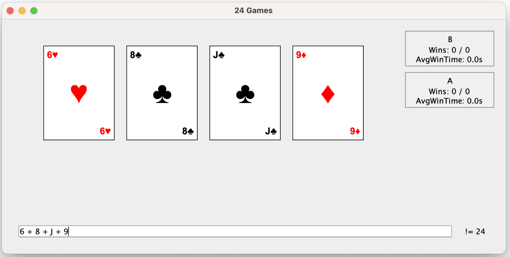
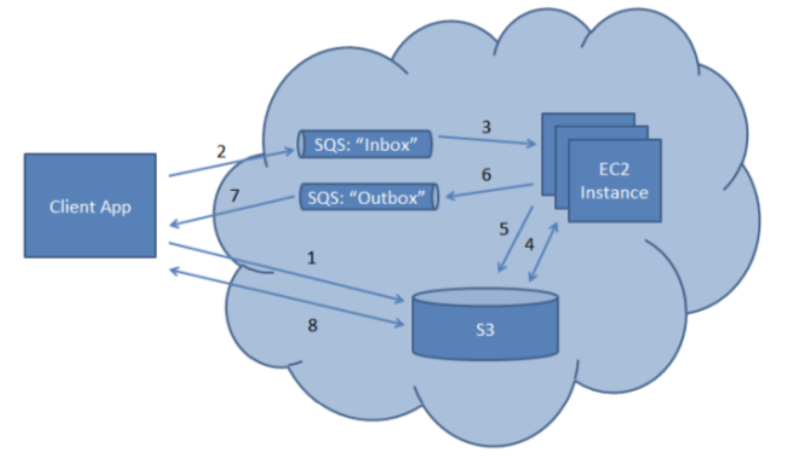

# Parallel_Processing

This project consists of three main programs,

## Twenty Four Card Game [Card_Game]

A desktop application with a GUI (made in Swing) that implements `The Twenty Four` card game. [Deprecated tools (like Java RMI, JMS, and JDBC) are used intentionally to demonstrate competence with legacy systems].

It has a robust login/registration system supported by a MySQL database (using JDBC), and uses Java RMI to connect the clients to the server. The user passwords are secured using hashing (and salting techniques) and access to the database is secured using prepared statements to prevent SQL injection attacks. The login process denies access to users already logged in, registration is only allowed for new users, and the game can only be played by logged-in users. Other standard features can be read about in the `login_report.pdf` file. A reader-writer lock is also used to prevent race-conditions on the database. More details about the structure of the tables can be found in the `database_structure.pdf` file.

The application has an inbuilt custom `parser` for parsing arithmetic expressions and then evulating the pasred abstract syntax tree (AST). The evaluator class handles evaluation logic and verifies the correctness of the solution. The game logic is implemented in a separate class. The source code for this can be found under the `card_game/TwentyFourGame/Client/Parsing/` directory. The parser supports basic arithmetic operations, parentheses, and operator precedence. It also handles errors gracefully, providing feedback to the user if the input is invalid.

The application also makes use of JMS queues and topics to handle communication between the users, and the game server. The application implements basic player match making logic to pair users for games using timers, waiting for a while to being a game (if at least 2 players live) unless four players join a session.
Details of the JMS implementation can be found in the `report.pdf` file, alongside the demo for the application and the build process for the application (on UNIX like systems).

    

## Image Resizer [img_resizer]

A image resizer Maven project that uses `AWS SQS` to handle image resizing tasks. The architecture for the server can be see below and the build process and result can be seen in the `report.pdf` file. Running the application requires a valid AWS account and the AWS CLI configured with the necessary permissions to access SQS and S3 services.

    

## MapReduce [map_reduce]

A MapReduce implementation in Java that uses `Apache Hadoop` to process large datasets. The project includes a custom mapper class to strip dates (and clean) data collected from YouTube. The `Spark` aggregators provided compute most popular YouTube channels and the time periods with the most uploads. The build process and results can be seen in the `report.pdf` file.

