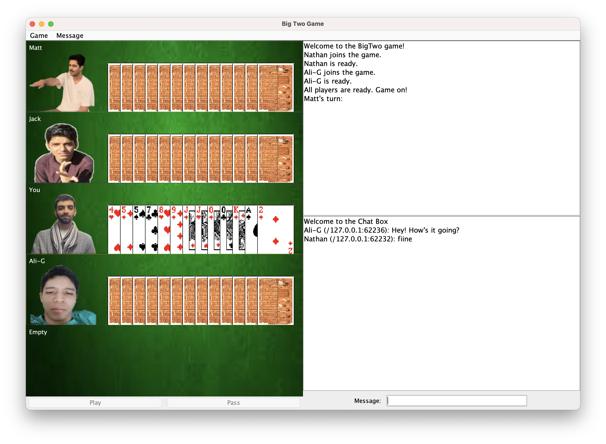
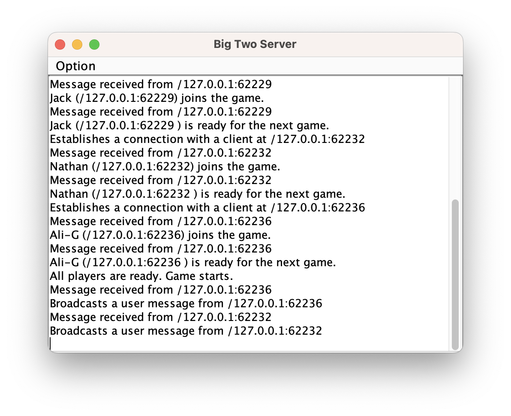

# Big Two - Java Card Game

A Java-based implementation of the popular Big Two card game. This project allows users to play the classic game with a focus on clear gameplay and an intuitive interface.

## Key Features

*   **Classic Big Two Rules:** Accurately implements the traditional rules, card rankings (2s high), and suit priorities.
*   **Graphical User Interface (GUI):** Provides a visual interface for playing cards, viewing the game state, and interacting with other players.
*   **Multiplayer Gameplay:** Supports 2-4 players for an authentic Big Two experience.
*   **Card Management:** Easy selection and playing of single cards, pairs, three-of-a-kind, and five-card hands (straights, flushes, full houses, four-of-a-kind, straight flushes).
*   **Turn-Based Logic:** Manages player turns and validates legal moves.


## Screenshots

Here are some screenshots of the Big Two game in action:

### Client View


### Server View



## Prerequisites

*   **Java Development Kit (JDK):** Version 8 or later. Ensure `java` and `javac` commands are available in your system's PATH.
    *   Download from [Oracle JDK](https://www.oracle.com/java/technologies/javase-downloads.html) or [OpenJDK](https://openjdk.java.net/).

## Setup and Compilation

You are currently in the project directory: `/Projects/Java/big_two/`.

### 1. Compiling the Source Code

1.  Open your terminal or command prompt in the project root.
2.  Compile the server application:
    ```bash
    javac BigTwoServer.java
    ```
3.  Compile the client application:
    ```bash
    javac BigTwo.java
    ```
    *Note: Compiling `BigTwoServer.java` and `BigTwo.java` should also compile any other `.java` files they depend on (e.g., card classes, player logic), provided those files are in the same directory and correctly referenced in the code.*

## Running the Game
After successful compilation, the `.class` files (e.g., `BigTwoServer.class`, `BigTwo.class`) will be located in the project root directory.

### 1. Start the Server

1.  Open your terminal or command prompt in the project root directory.
2.  Execute the server application:
    ```bash
    java BigTwoServer
    ```
    The server will start and wait for client connections.

### 2. Start the Client(s)

1.  For each player, open a new terminal or command prompt in the project root directory.
2.  Execute the client application:
    ```bash
    java BigTwo
    ```
    Repeat this step for each player. The game supports 2-4 players. Each client will connect to the server.


## Technologies Used

*   **Java:** Core programming language.
*   **Swing:** For the graphical user interface.
