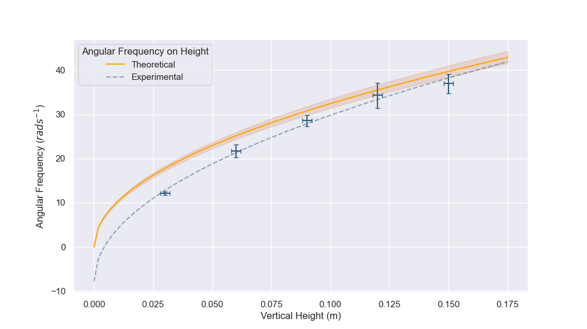
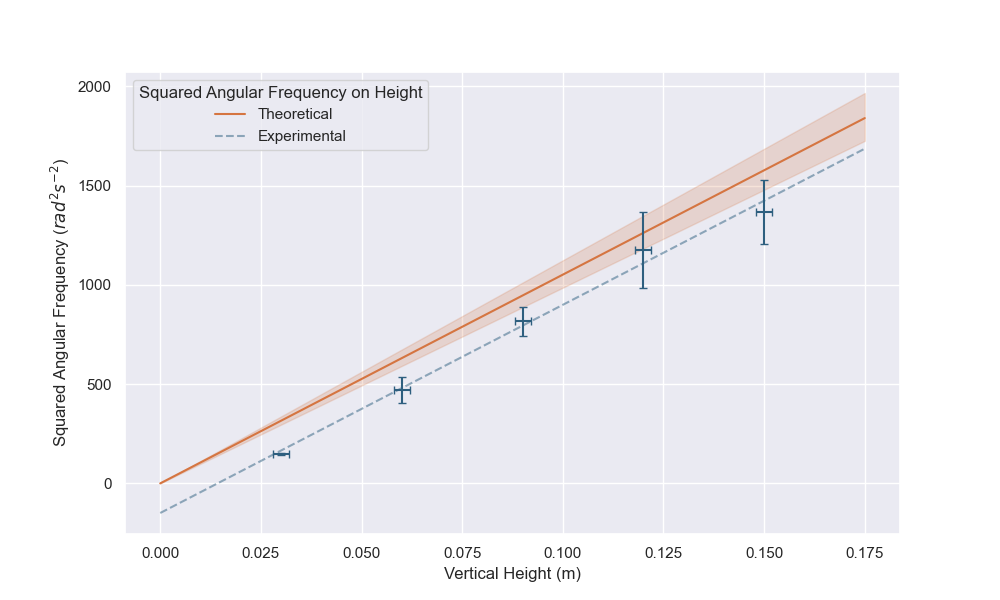

## The Model 

A thick cylinder with inner radius $r$ and and outer radius $R$ is release from rest at a vertical height $h$ on a rough inclined plane.

The cylinder rolls down the plane withot slipping or sliding, and the period for one whole rotation is recorded with varying heights. 

The experiment is repeated for 3 times at each height, and the average period is calculated.

The angular frequency $\omega$ of the cylinder is then calculated with the formula $\omega = \frac{2\pi}{T}$, where $T$ is the period of one whole rotation.

The angular frequency  of the cylinder is measured at different heights. The theoretical model for the angular frequency can derived as a function of height $h$ and the inner and outer radius of the cylinder $r$ and $R$ as follows.

The moment of inertia of the cylinder is given by $I = \frac{1}{2}m(R^2 + r^2)$, where $m$ is the mass of the cylinder. The potential energy at height $h$ is $U = mgh$, the kinetic energy at the bottom of the incline is $K = \frac{1}{2}mv^2 + \frac{1}{2}I\omega^2$.

By conservation of energy, we have $mgh = \frac{1}{2}mv^2 + \frac{1}{2}I\omega^2$.

Since the cylinder rolls without slipping, we have $v = \omega R$. Therefore, the kinetic energy can be rewritten as $K = \frac{1}{2}m(\omega R)^2 + \frac{1}{2}I\omega^2$.

Substituting the expression for $I$ and rearranging, we can derive the formula for the angular frequency $\omega$ as a function of height $h$, inner radius $r$, and outer radius $R$:

$$\omega^2 = \frac{4gh}{3R^2 + r^2}$$

